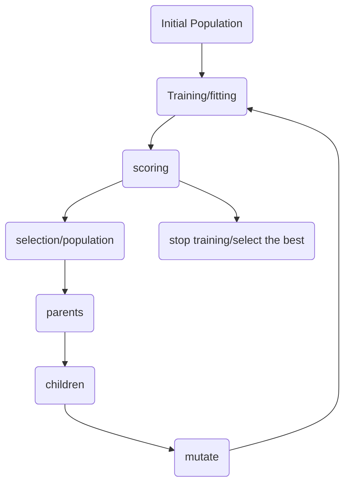

# Population based training
## 

```mermaid
flowchart TD
    A(Initial Population)-->B(training/fitting)
    B-->C(scoring)
    C-->D(selection/population)
    D-->E(parents)
    E-->F(children)
    F-->I(mutate)
    I-->B(Training/fitting)
    C-->G(stop training/select the best)

```